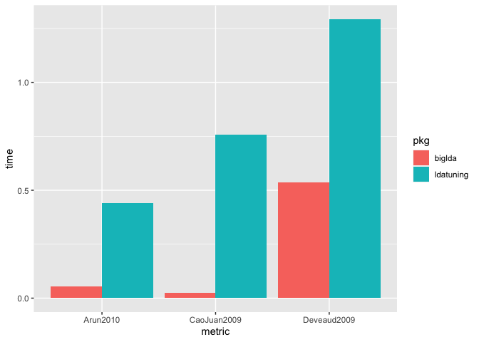

Introducing the biglda package
================

<!-- README.md is generated from README.Rmd. Please edit that file -->

[](https://www.gnu.org/licenses/gpl-3.0)
[](https://github.com/PolMine/biglda/actions)
[](https://codecov.io/gh/PolMine/biglda/branch/master)

## Package for fast LDA topic modelling for big corpora.

Topic modelling is an established and useful unsupervised learning
technique for detecting topics in large collections of text. Among the
many variants of topic modelling and innovations that are been tried,
the classic ‘Latent Dirichlet Allocation’ (LDA) algorithm remains to be
a powerful tool that yields good results. Yet computing LDA topic models
requires significant system resources, particularly when corpora grow
large. The biglda package addresses three specific issues that may be
outright obstacles to using LDA topic models productively and in a
state-of-the-art fashion.

The package addresses issues of computing time and RAM limitations at
the different relevant stages when working with topic models:

- *Data preparation and import*: Issues of performance and memory
  efficiency start to arise when preparing input data for a training
  algorithm.

- *Fitting topic models*: Computing time for a single topic model may be
  extensive. It is good practice to evaluate a set of topic models for
  hyperparameter optimization. So you need a fast implementation of LDA
  topic modelling to be able to fit a set of topic models within
  reasonable time.

- *To cost of interfacing*: R is very productive for developing your
  analysis, but the best implementations of LDA topic modelling are
  written in Python, Java and C. Transferring the data between
  programming languages is a potential bottleneck and can be quite slow.

- *Evaluating topic models*: Issues performance and memory efficiency
  are relevant when computing indicators to assess topic models may be
  considerable. Computations require mathematical operations with really
  large matrices. Memory may be exhausted easily.

More plastically spoken: As you work with increasingly large data,
fitting and evaluating topic models can bring hours and days you wait
for a result to emerge, just to see that the process crashes because
memory has been exhausted.

The biglda package addresses performance and memory efficiency issues
for R users at all stages. The *ParallelTopicModel* class from the
Machine Learning for Language Toolkit ‘mallet’ offers a fast
implementation of an LDA topic model that yields good results. The
purpose of the ‘biglda’ package is to offer a seamless and fast
interface to the Java classes of ‘mallet’ so that the multicore
implementation of the LDA algorithm can be used. The `as_LDA()` function
can be used to map the mallet model on the `LDA_Gibbs` class from the
widely used `topicanalysis` package.

## Installation

### ‘biglda’ package

The biglda package is a GitHub-only package at this time. Install the
stable version as follows.

``` r
remotes::install_github("PolMine/biglda")
```

Install the development version of the package as follows.

``` r
remotes::install_github("PolMine/biglda", ref = "dev")
```

### Installing Mallet

The focus of the biglda package is to offer a seamless interface to
Mallet. The `biglda::mallet_install()` function installs Mallet
(v202108) in a directory within the package. The big disadvantage of
this installation mechanism is that the Mallet installation is
overwritten whenever you install a new version of biglda, and Mallet
needs to be installed anew. This is why installing Mallet in the storage
location used by your system for add-on software (such as “/opt” on
Linux/macOS) is recommended.

We strongly recommend to install the latest version of Mallet (v202108
or higher). Among others, it includes a new
`$printDenseDocumentTopics()` method of the `ParallelTopicModel` used by
`biglda::save_document_topics()`, improving the efficiency of moving
data from Java/Mallet to R significantly.

Note that v202108 is a “serialization-breaking release”. Instance files
and binary models prepared using previous versions cannot be processed
with this version and may have to be rebuilt.

On Linux and macOS machines, you may use the following lines of code for
installing Mallet. Note that admin privileges (“sudo”) may be required.

``` sh
mkdir /opt/mallet
cd /opt/mallet
wget https://github.com/mimno/Mallet/releases/download/v202108/Mallet-202108-bin.tar.gz
tar xzfv Mallet-202108-bin.tar.gz
rm Mallet-202108-bin.tar.gz
```

### Installing rJava

``` r
R CMD javareconf
```

### Installing Gensim

``` r
install.packages("reticulate")
library(reticulate)
reticulate::install_miniconda()
reticulate::conda_install(packages = "gensim")
```

## Using biglda

### Loading biglda

Note that it is not possible to use the R packages “biglda” and “mallet”
in parallel. If “mallet” is loaded, it will put its Java Archive on the
classpath of the Java Virtual Machine (JVM), making the latest version
of the `ParallelTopicModel` class inaccessible and causing errors that
may be difficult to understand. Therefore, a warning will be issued when
“biglda” may detect that the JAR included in the “mallet” package is in
the classpath.

``` r
options(java.parameters = "-Xmx8g")
Sys.setenv(MALLET_DIR = "/opt/mallet/Mallet-202108")
library(biglda)
```

    ## Mallet version: v202108

    ## JVM memory allocated: 7.1 Gb

### A sample workflow

When using Mallet for topic modelling, the first step is to prepare a
so-called “instance list” with information on the input documents. In
this example, we use the `AssociatedPress` dataset included in the
topicmodels package.

``` r
data("AssociatedPress", package = "topicmodels")
instance_list <- as.instance_list(AssociatedPress, verbose = FALSE)
```

We then instantiate a `BigTopicModel` class object with hyperparameters.
This class is a super class of the `ParallelTopicModel` class, the
efficient worker of Mallet topic modelling. The superclass adds methods
to this class that greatly speed up transferring data at the R-Java
interface.

``` r
BTM <- BigTopicModel(n_topics = 100L, alpha_sum = 5.1, beta = 0.1)
```

This result (object `BTM`) is a Java object of class “jobjRef”. Methods
of this (Java) class are accessible from R, and are used to configure
the topic modelling engine. The first step is to add the instance list.

``` r
BTM$addInstances(instance_list)
```

We then set the number of iterations to 1000 and just use one thread
core. Note that using multiple cores speeds up topic modelling - see
performance assessment below.

``` r
BTM$setNumIterations(1000L)
BTM$setNumThreads(1L)
```

Finally, we control the verbosity of the engine. By default, Mallet
issues a status message every 10 iterations and reports the top words
for topics every 100 iterations. For the purpose of rendering this
document, we turn these progress reports off.

``` r
BTM$setTopicDisplay(0L, 0L) # no intermediate report on topics
BTM$logger$setLevel(rJava::J("java.util.logging.Level")$OFF) # remain silent
```

We now fit the topic model and report the time that has elapsed for
fitting the model.

``` r
started <- Sys.time()
BTM$estimate()
Sys.time() - started
```

    ## Time difference of 31.96075 secs

The package includes optimized functionality for evaluating the topic
model. Metrics are computed as follows.

``` r
lda <- as_LDA(BTM, verbose = FALSE)
N <- BTM$getDocLengthCounts()
data.frame(
  arun2010 = BigArun2010(beta = B(lda), gamma = G(lda), doclengths = N),
  cao2009 = BigCao2009(X = B(lda)),
  deveaud2014 = BigDeveaud2014(beta = B(lda))
)
```

    ##   arun2010    cao2009 deveaud2014
    ## 1 3380.157 0.02694574    3.064358

## Performance

To convey that biglda is fast, we fit topic models with Mallet with
different numbers of cores and compare computing time with topic
modelling with `topicmodels::LDA()`. The corpus used is
`AssociatedPress` as represented by a `DocumentTermMatrix` included in
the `topicmodel` package. Here, we just run 100 iterations for a limited
set of `k` topics. In “real life”, you would have more iterations
(typically 1000-2000), but this setup is sufficiently informative on
performance.

So we start with the general settings.

``` r
k <- 100L
iterations <- 100L
n_cores_max <- parallel::detectCores() - 2L # use all cores but two
data("AssociatedPress", package = "topicmodels")
report <- list()
```

We then fit topic models with Mallet with a varying number of cores.

``` r
library(biglda)

instance_list <- as.instance_list(AssociatedPress, verbose = FALSE)

for (cores in 1L:n_cores_max){
  mallet_started <- Sys.time()

  BTM <- BigTopicModel(n_topics = k, alpha_sum = 5.1, beta = 0.1)
  BTM$addInstances(instance_list)
  BTM$setNumThreads(cores)
  BTM$setNumIterations(iterations)
  BTM$setTopicDisplay(0L, 0L) # no intermediate report on topics
  BTM$logger$setLevel(rJava::J("java.util.logging.Level")$OFF) # remain silent
  
  BTM$estimate()
  
  report[[cores]] <- data.frame(
    tool = sprintf("mallet_%d", cores),
    time = as.numeric(difftime(Sys.time(), mallet_started, units = "mins"))
  )
}
```

And we run the classic implementation of LDA topic topic modelling in
the topicmodels package.

``` r
library(topicmodels)

topicmodels_started <- Sys.time()

lda_model <- LDA(
  AssociatedPress,
  k = k,
  method = "Gibbs",
  control = list(iter = iterations)
)

report[[n_cores_max + 1]] <- data.frame(
  tool = "topicmodels",
  time = difftime(Sys.time(), topicmodels_started, units = "mins")
)
```

The following chart reports the elapsed time for LDA topic modelling.

``` r
library(ggplot2)
ggplot(data = do.call(rbind, report), aes(x = tool, y = time)) +
  geom_bar(stat="identity")
```

<!-- -->

So topic modelling with Mallet is fast and even more so with several
cores. So for large data, biglda can make the difference, whether it
takes a week or a day for fit the topic model.

Note that we did not an evaluation of `stm::stm()` (structural topic
model) here, which has become a widely used state-of-the-art algorithm.
The stm package offers very rich analytical possibilities and the
ability to include document metadata goes significantly beyond classic
LDA topic modelling. But `stm::stm()` is significantly slower than
`topicmodels::LDA()`. The stm package does not address big data
scenarios very well, this is the specialization of the biglda package.

### Metrics

The package implements the metrics for topic models of the ldatuning
package (Griffiths2004 still missing) using RcppArmadillo. Based on the
following code used for benchmarking, the following chart conveys that
the biglda funtions `BigArun2010()`, `BigCao2009()` and
`BigDeveaud2014()` are significantly faster than their counterparts in
the ldatuning package.

``` r
library(ldatuning)

metrics_timing <- data.frame(
  pkg = c(rep("ldatuning", times = 3), rep("biglda", times = 3)),
  metric = c(rep(c("Arun2010", "CaoJuan2009", "Deveaud2009"), times = 2)),
  time = c(
    system.time(Arun2010(models = list(lda_model), dtm = AssociatedPress))[3],
    system.time(CaoJuan2009(models = list(lda_model)))[3],
    system.time(Deveaud2014(models = list(lda_model)))[3],
    system.time(BigArun2010(
      beta = B(lda_model),
      gamma = G(lda_model),
      doclengths = BTM$getDocLengthCounts()))[3],
    system.time(BigCao2009(B(lda_model)))[3],
    system.time(BigDeveaud2014(B(lda_model)))[3]
  )
)

ggplot(metrics_timing, aes(fill = pkg, y = time, x = metric)) + 
    geom_bar(position = "dodge", stat = "identity")
```

<!-- -->

Note that apart from speed, the RcppArmadillo/C++ implementation is much
more memory efficient. Computations of metrics that may fail with
ldatuning functionality because memory is exhausted will often work fast
and successfully with the biglda package.

## R Markdown templates for topic modelling

The examples here and in the package documentation including vignettes
need to be minimal working examples to keep computing time low when
building the package. In real-life scenarios, we recommend to use
scripts for topic modelling on large datasets and to execute the script
from the command line. R Markdown are an ideal alternative to plain R
scripts that can be run with a shell command such as \`\`.

- **Mallet**
- **Gensim**
- **Gensim2**

## Related work

The R package “mallet” has been around for a while and is the
traditional interface to the “mallet” Java package for R users. However,
the a [RTopicModel
class](https://github.com/mimno/Mallet/blob/af1fcb1f3e6561afac28f4331e4e0d735b3d11b4/src/cc/mallet/topics/RTopicModel.java)
is used as an interface to the `ParallelTopicModel` class, hiding the
method to define the number of cores to be used from the R used, thus
limiting the potential to speed up the computation of a topic model
using multiple threads. What is more, functionality for full access to
the computed model is hidden, inhibiting the extraction of the
information the mallet LDA topic model that is required to map the topic
model on the LDA_Gibbs topic model.

- [mallet](https://CRAN.R-project.org/package=mallet) R package
- [dfrtopics](https://github.com/agoldst/dfrtopics)

## Discussion

The biglda package is designed for heavy-duty work with large data sets.
If you work with smaller data, other approaches and implementations that
are established and that may be easier to use and to install (the rJava
Blues!)  
do a very good job indeed. But we are not just happy to also have
biglda. Jobs with big data may just take too long or simply fail because
memory is exhausted. We think that biglda pushes the frontier of being
able of productively using topic modelling in the R realm.

(Alternative: Command line use of Mallet. Quarto.)

## Useful sources

David Minmo, “The Details: Training and Validating Big Models on Big
Data”:
<http://journalofdigitalhumanities.org/2-1/the-details-by-david-mimno/>
